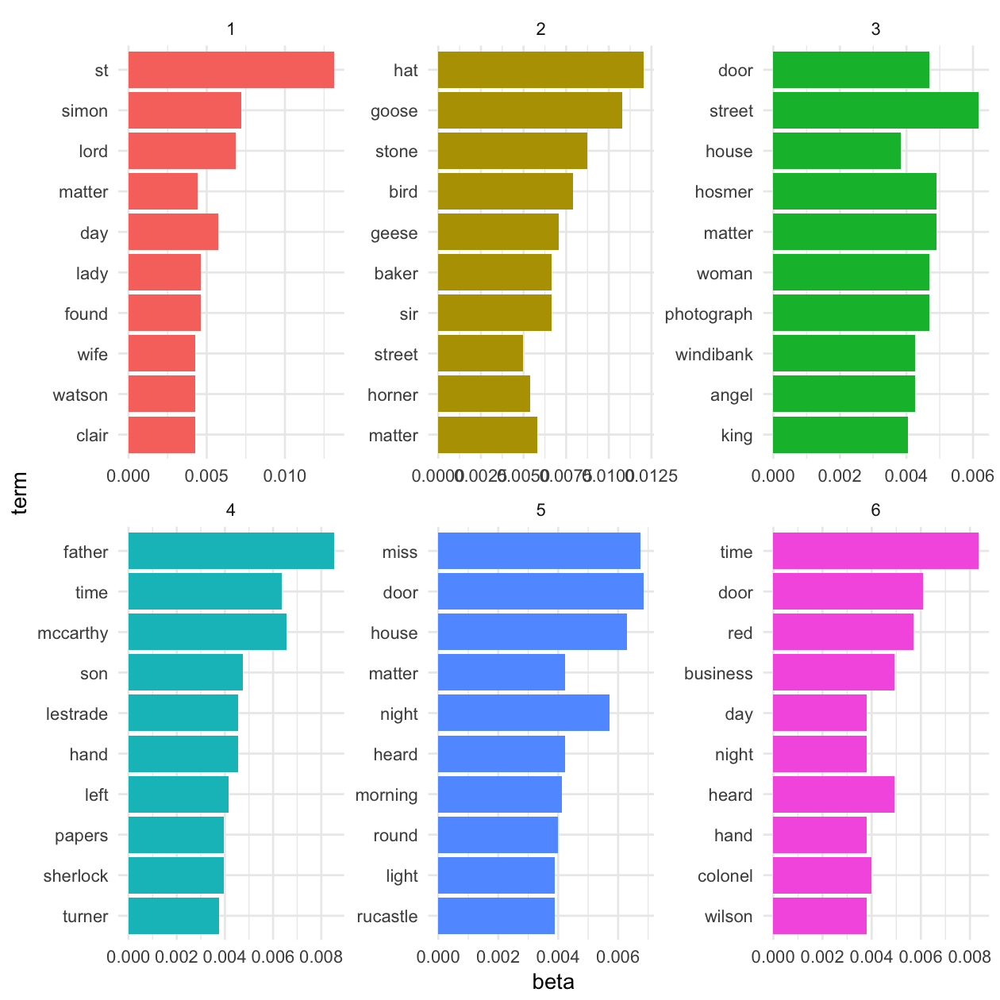

```r
library(tidyverse)
library(tidytext)
library(gutenbergr)
library(stringr)

my_stop_words <- stop_words %>%
    filter(lexicon == "snowball")

sherlock <- gutenberg_download(1661) %>%
    mutate(story = case_when(str_detect(text, "ADVENTURE") ~ text,
                             TRUE ~ NA_character_)) %>%
    fill(story) %>%
    filter(story != "THE ADVENTURES OF SHERLOCK HOLMES") %>%
    mutate(story = factor(story, levels = unique(story)))

tidy_sherlock <- sherlock %>%
    mutate(line = row_number()) %>%
    unnest_tokens(word, text) %>%
    anti_join(stop_words) %>%
    filter(word != "holmes")

tidy_sherlock
```

```
## # A tibble: 31,569 x 4
##    gutenberg_id                             story  line      word
##           <int>                            <fctr> <int>     <chr>
##  1         1661 ADVENTURE I. A SCANDAL IN BOHEMIA     1 adventure
##  2         1661 ADVENTURE I. A SCANDAL IN BOHEMIA     1   scandal
##  3         1661 ADVENTURE I. A SCANDAL IN BOHEMIA     1   bohemia
##  4         1661 ADVENTURE I. A SCANDAL IN BOHEMIA     5  sherlock
##  5         1661 ADVENTURE I. A SCANDAL IN BOHEMIA     5     woman
##  6         1661 ADVENTURE I. A SCANDAL IN BOHEMIA     5    seldom
##  7         1661 ADVENTURE I. A SCANDAL IN BOHEMIA     5     heard
##  8         1661 ADVENTURE I. A SCANDAL IN BOHEMIA     6   mention
##  9         1661 ADVENTURE I. A SCANDAL IN BOHEMIA     6      eyes
## 10         1661 ADVENTURE I. A SCANDAL IN BOHEMIA     6  eclipses
## # ... with 31,559 more rows
```


## Explore tf-df


```r
tidy_sherlock %>%
    count(story, word, sort = TRUE) %>%
    bind_tf_idf(word, story, n) %>%
    arrange(-tf_idf) %>%
    group_by(story) %>%
    top_n(10) %>%
    ungroup %>%
    mutate(word = reorder(word, tf_idf)) %>%
    ggplot(aes(word, tf_idf, fill = story)) +
    geom_col(alpha = 0.8, show.legend = FALSE) +
    facet_wrap(~ story, scales = "free") +
    coord_flip()
```


## Implement topic modeling


```r
library(quanteda)
library(stm)

sherlock_dfm <- tidy_sherlock %>%
    count(story, word, sort = TRUE) %>%
    cast_dfm(story, word, n)
save(sherlock_dfm, file = "sherlock_dfm.rda")

topic_model <- stm(sherlock_dfm, K = 6, verbose = FALSE, init.type = "Spectral")
save(topic_model, file = "topic_model.rda")
```


```r
td_beta <- tidy(topic_model)
td_beta
```

```
## # A tibble: 44,622 x 3
##    topic  term         beta
##    <int> <chr>        <dbl>
##  1     1     1 0.000000e+00
##  2     2     1 0.000000e+00
##  3     3     1 2.128994e-04
##  4     4     1 0.000000e+00
##  5     5     1 0.000000e+00
##  6     6     1 0.000000e+00
##  7     1    10 4.749082e-33
##  8     2    10 1.181432e-27
##  9     3    10 1.008600e-28
## 10     4    10 1.982979e-04
## # ... with 44,612 more rows
```

```r
td_beta %>%
    group_by(topic) %>%
    top_n(10, beta) %>%
    ungroup() %>%
    mutate(term = reorder(term, beta)) %>%
    ggplot(aes(term, beta, fill = as.factor(topic))) +
    geom_col(show.legend = FALSE) +
    facet_wrap(~ topic, scales = "free") +
    coord_flip()
```




```r
td_gamma <- tidy(topic_model, matrix = "gamma",                    
                 document_names = rownames(sherlock_dfm))
td_gamma
```

```
## # A tibble: 72 x 3
##                                      document topic        gamma
##                                         <chr> <int>        <dbl>
##  1          ADVENTURE I. A SCANDAL IN BOHEMIA     1 6.551130e-05
##  2        ADVENTURE II. THE RED-HEADED LEAGUE     1 8.226517e-05
##  3          ADVENTURE III. A CASE OF IDENTITY     1 7.733140e-05
##  4  ADVENTURE IV. THE BOSCOMBE VALLEY MYSTERY     1 3.725668e-05
##  5          ADVENTURE V. THE FIVE ORANGE PIPS     1 4.970927e-05
##  6 ADVENTURE VI. THE MAN WITH THE TWISTED LIP     1 9.997254e-01
##  7   VII. THE ADVENTURE OF THE BLUE CARBUNCLE     1 6.553920e-05
##  8   VIII. THE ADVENTURE OF THE SPECKLED BAND     1 2.256179e-05
##  9  IX. THE ADVENTURE OF THE ENGINEER'S THUMB     1 9.048406e-05
## 10     X. THE ADVENTURE OF THE NOBLE BACHELOR     1 9.996880e-01
## # ... with 62 more rows
```

```r
ggplot(td_gamma, aes(gamma, fill = as.factor(topic))) +
  geom_histogram(show.legend = FALSE) +
  facet_wrap(~ topic, ncol = 4) +
  labs(title = "Distribution of probability for each topic",
       y = "Number of documents", x = expression(gamma))
```


```r
assignments <- augment(topic_model, sherlock_dfm)
assignments
```

```
## # A tibble: 17,762 x 4
##                                      document  term count .topic
##                                         <chr> <chr> <dbl>  <int>
##  1          ADVENTURE I. A SCANDAL IN BOHEMIA    st     4      1
##  2        ADVENTURE II. THE RED-HEADED LEAGUE    st     3      2
##  3          ADVENTURE III. A CASE OF IDENTITY    st     2      1
##  4          ADVENTURE V. THE FIVE ORANGE PIPS    st     1      1
##  5 ADVENTURE VI. THE MAN WITH THE TWISTED LIP    st    29      2
##  6   VII. THE ADVENTURE OF THE BLUE CARBUNCLE    st     1      1
##  7     X. THE ADVENTURE OF THE NOBLE BACHELOR    st    42      2
##  8     X. THE ADVENTURE OF THE NOBLE BACHELOR simon    39      2
##  9        ADVENTURE II. THE RED-HEADED LEAGUE  lord     1      2
## 10  ADVENTURE IV. THE BOSCOMBE VALLEY MYSTERY  lord     1      1
## # ... with 17,752 more rows
```


